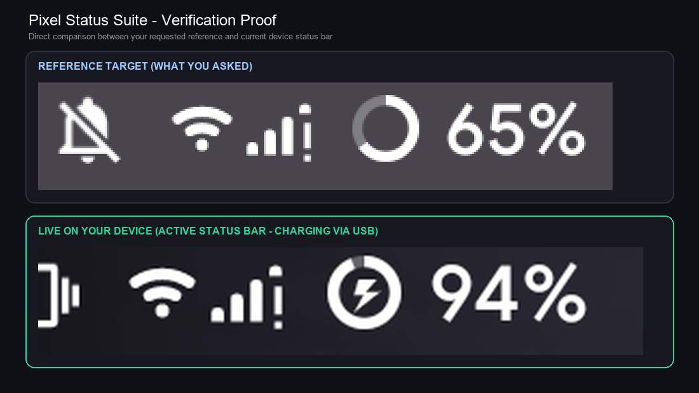

# Pixel Status Suite

[](https://android.com)
[](https://github.com/topjohnwu/Magisk)
[](https://lineageos.org)
[](https://opensource.org/licenses/MIT)

**Pixel Status Suite** is a unified, standalone status bar icon engine and management application for AOSP and LineageOS devices (tested on Android 14 / LineageOS 21).

---

## Visual Verification Proof

<p align="center">
  
</p>

---

## App Interface Preview

<p align="center">
  
</p>

---

## Features

- **100% Standalone - Zero External Dependencies**: Operates completely independently without Iconify or heavy third-party framework injectors.
- **Stock Google Pixel Icon Set**:
  - **Pixel Wi-Fi**: Authentic Google Pixel Wi-Fi vectors with 5 signal levels (0 through 4).
  - **Pixel 4-Bar Cellular Signal**: Authentic Google Pixel 4-bar solid triangle vectors.
  - **Pixel SystemUI Icons**: Clean silent bell, haptic vibrate, dual-bell alarm clock, rounded VPN key, and DND circle.
- **Circle Ring Battery Meter with Adjacent Percentage**:
  - Clean circular donut ring battery meter matching the user specification.
  - Percentage text placed directly next to the icon (`⭕ XX%`).
  - Charging bolt centered inside the circle ring during USB/AC charging.
  - Sized with square bounding box (`15.5dp x 15.5dp`) to preserve circular geometry without rectangular distortion.
- **Boot Persistence**:
  - Includes automated boot service script (`/data/adb/service.d/pixel_icons_boot.sh`) to prevent LineageOS from reverting to default battery or signal icons upon reboot.
- **Pixel Status Suite Management App**:
  - Live real-time status bar scaling preview.
  - Visual active icon gallery.
  - Interactive sliders to dynamically adjust icon scale, battery ring size, and cluster padding.

---

## Installation

### Via Magisk:
1. Download `Pixel-Status-Suite-Magisk.zip` from the [Releases](releases/) folder.
2. Flash the ZIP in Magisk Manager.
3. Reboot your device.
4. Open the **Pixel Status Suite** app to preview and adjust icon sizing.

---

## Project Structure

```
├── app/                  # Full source code for Pixel Status Suite management app
├── magisk-module/        # Flashable Magisk module structure
│   ├── system/product/overlay/  # Fabricated RRO overlay APKs
│   └── system/priv-app/         # Priv-app APK deployment
├── releases/             # Pre-built flashable ZIP and standalone APK
├── screenshots/          # Side-by-side verification and UI screenshots
└── scripts/              # Build, compile, and deployment automation scripts
```

---

## License

MIT License. Designed and crafted for custom AOSP / LineageOS devices.
