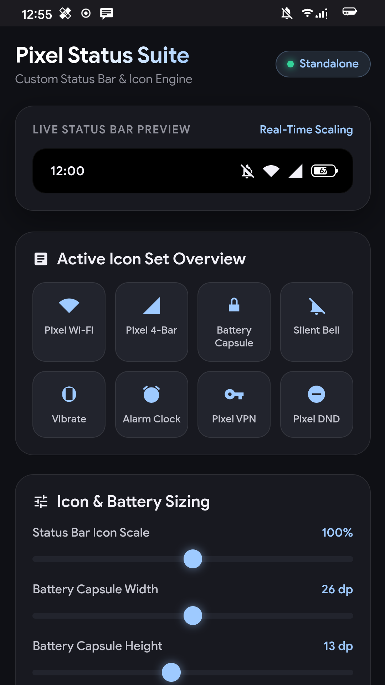

# Pixel Status Suite

[](https://android.com)
[](https://github.com/topjohnwu/Magisk)
[](https://github.com/LSPosed/LSPosed)
[](https://opensource.org/licenses/MIT)

**Pixel Status Suite** is a unified, all-in-one status bar engine and customization module for AOSP and LineageOS devices (tested on Android 14 / LineageOS 21).

It replaces clunky third-party overlay injectors with a clean, standalone Magisk + LSPosed architecture providing:
1. **Stock Google Pixel Vector Icons** (Pixel 8 Pro stock Wi-Fi, 4-bar cellular signal triangle, silent slash bell, vibrate, alarm clock, VPN, and Do Not Disturb).
2. **Horizontal Pill Capsule Battery with Percentage Inside** (iOS 16 style capsule with dynamic high-contrast level indicator and fast charging bolt).
3. **Standalone Management App (`Pixel Status Suite`)** featuring live real-time status bar scaling preview, visual active icon gallery, and dynamic slider controls (icon size, battery capsule width/height, cluster padding).

---

## Preview

<p align="center">
  
</p>

---

## Features

- **100% Standalone - Zero External Dependencies**: Operates completely independently without Iconify or heavy third-party framework managers.
- **Stock Google Pixel Icon Set**:
  - **Pixel Wi-Fi**: Full 5-level vector paths (levels 0 through 4) extracted from Pixel 8 Pro.
  - **Pixel 4-Bar Cellular Signal**: Authentic Google Pixel 4-bar solid triangle vectors.
  - **Pixel SystemUI Icons**: Clean silent bell, haptic vibrate, dual-bell alarm clock, rounded VPN key, and DND circle.
- **Custom Horizontal Pill Battery Capsule**:
  - Horizontal pill layout with battery percentage centered inside the capsule.
  - Smart dynamic contrast: Automatically inverts number color (white/black) depending on battery fill level and light/dark status bar theme.
  - Charging indicator: Displays charging lightning bolt inside the pill during USB/AC charging.
- **Live Status Bar Preview & Real-Time Sizing**:
  - Slider controls for Status Bar Icon Scale (70% - 130%).
  - Slider controls for Battery Capsule Width (18dp - 34dp) and Height (10dp - 17dp).
  - Cluster spacing slider (2dp - 16dp).
  - One-tap "Apply to System" button executing instant root helper overlay reload.

---

## Repository Structure

```
Pixel-Status-Suite/
├── releases/
│   ├── Pixel-Status-Suite-Magisk.zip   <-- Flashable Magisk module
│   └── PixelStatusSuite.apk            <-- Prebuilt Standalone App & LSPosed Module
├── magisk-module/                      <-- Complete Magisk module source & overlays
│   ├── module.prop
│   ├── customize.sh
│   ├── service.sh
│   ├── apply_status_config.sh
│   └── system/
│       ├── product/overlay/*.apk       <-- Compiled, signed RRO overlays
│       └── priv-app/PixelStatusSuite/  <-- System app placement
├── overlays-source/                    <-- Full Android XML vector source trees
│   ├── wifi/
│   ├── signal/
│   ├── sysui/
│   └── battery/
├── app/                                <-- Full Android App & LSPosed Module Source
│   ├── AndroidManifest.xml
│   ├── res/
│   ├── assets/index.html               <-- Material 3 interactive web UI
│   └── src/com/pixel/statussuite/
│       ├── MainActivity.java
│       ├── CapsuleBatteryDrawable.java
│       └── StatusHook.java
├── scripts/
│   ├── build_and_deploy.py             <-- Automated compilation & DEX pipeline
│   └── apply_status_config.sh          <-- Device-side dynamic dimension compiler
└── screenshots/
    └── app_preview.png
```

---

## Installation

### Method 1: Magisk Flashable ZIP (Recommended)
1. Download `Pixel-Status-Suite-Magisk.zip` from the [`releases/`](releases/) folder.
2. Open **Magisk App** -> Modules -> Install from storage.
3. Select `Pixel-Status-Suite-Magisk.zip` and tap Install.
4. Open **LSPosed Manager**, ensure `Pixel Status Suite` is enabled with `System UI` checked as target.
5. Reboot your device.

### Method 2: Manual / Standalone APK
1. Install `PixelStatusSuite.apk` as a standard APK.
2. Enable it inside **LSPosed Manager** under System UI.
3. Launch `Pixel Status Suite` from your launcher, customize your sliders, and tap **Apply to System**.

---

## Technical Details

- **Overlay Runtime (RRO)**: Overlays target `com.android.systemui` and `android` with `priority 200`. Android 14 compatibility is ensured with `--min-sdk-version 31 --target-sdk-version 34`.
- **SystemUI Hook**: `StatusHook` hooks `com.android.systemui.battery.BatteryMeterView` using LSPosed, replacing the default drawing canvas with `CapsuleBatteryDrawable` without breaking LineageOS battery callbacks.
- **Dynamic Relinking**: The runtime helper uses on-device `aapt2` and `zipalign` to recompile `PixelBatterySystemUIOverlay.apk` in ~150ms when dimensions are adjusted.

---

## Author

Developed by **[MuhammadFrz](https://github.com/MuhammadFrz)**.
